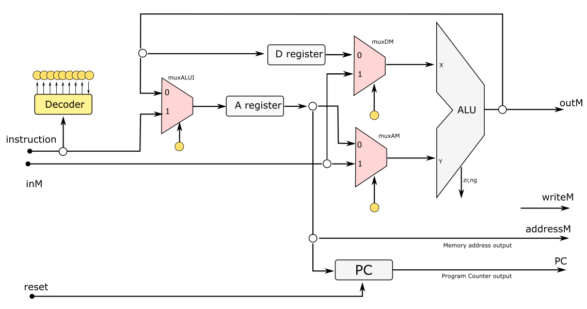

# Av3 - 1° Semestre de 2022


Avaliação 2 - Elementos de Sistemas

| Pontos HW | Pontos SW |
|:---------:|:---------:|
| 20        | 35        |

- Avaliação **individual**.
- **100 min** total.
- Ficar no blackboard durante a prova.
- Clonar o seu repositório (e trabalhar nele)
- Editar o arquivo `ALUNO.json`
- Fazer **commit** ao final de cada questão.
- Lembre de dar **push** ao final.


As questões de hardware (`.vhd`) devem ser implementadas nos arquivos localizados na pasta `src/vhd`, as questões de software (`nasm`) devem ser implementadas nos arquivos localizados em `src/nasm`. Os scripts a seguir testam respectivamente a parte de hardware e software:

```
./testeHW.py
./testeAssembly.py
```

> Vocês devem editar o arquivo `config_testes.txt` selecionando o que desejam testar.

**LEMBRE DE REALIZAR UM COMMIT (A CADA QUESTÃO) E DAR PUSH AO FINALIZAR**

## 1. Assembly

| Pontos HW | Pontos SW |
|:---------:|:---------:|
| 0         | 35        |

Todos os registradores do nosso computador Z01.1 são de 16 bits. No entanto, queremos utilizá-lo agora para realizar uma operação matemática de 32 bits.

Considere que os 16 bits menos significativos de um número W estejam armazenados na RAM[0] e os 16 bits mais significativos estejam armazenados na RAM[1]. Considere também que os 16 bits menos significativos de um número T estejam armazenados na RAM[2] e os 16 bits mais significativos estejam armazenados na RAM[3]. 

Faça um código em Assembly que:

- calcule W + T. 
- salve os 16 bits menos significativos do resultado na RAM[4] e os 16 bits mais significativos na RAM[5].
- acenda o LED[0] da FPGA se o resultado da soma for negativo, caso contrário o LED[0] deve ficar desligado.

> Desconsidere a possibilidade de overflow, isto é, considere que o resultado da operação (independentemente de ser positivo ou negativo) pode ser representado em 32 bits
> Dica: lembre-se que para fazer a soma, é necessário considerar o vaium dos 16 bits menos significativos para os 16 mais significativos. Esse vaium irá ocorrer quando:
 - (RAM[0][15] = 1 E RAM[2][15] = 1) OU 
 - (RAM[0][15] = 1 E RAM[2][15] = 0 E RAM[4][15] = 0) OU
 - (RAM[0][15] = 0 E RAM[2][15] = 1 E RAM[4][15] = 0) 
> Dica: o bit mais significativo do resultado continua indicando o sinal.

#### Exemplo:

W = "00110011001100110000111100001111"
T  = "00001111000011110011001100110011"

Representação na memória:
RAM[0] = "0000111100001111"
RAM[1] = "0011001100110011"
RAM[2] = "0011001100110011"
RAM[3] = "0000111100001111"

Resultado:

W+T = "01000010010000100100001001000010"

RAM[4] = '0100001001000010'
RAM[5] = '0100001001000010'

LED[0] => desligado => número postivio

### Implementação

Implemente o código Assembly para realizar as funções descritas no arquivo `src/nasm/soma32.nasm`

#### Rubrica para avaliação:

| Pontos SW | Descritivo                                                                             |
|-----------|----------------------------------------------------------------------------------------|
| 10        | Código para detecção do sinal do resultado implementado corretamente (Testes 0 e 1)    |
| 10        | Somas RAM[0] + RAM[2] e RAM[1] + RAM[3] implementadas corretamente (Testes 2 e 3)      |
| 10        | Detecção do vaium da soma RAM[0] + RAM[2]                                              |
| 5         | Soma do vaium com o resultado de RAM[1] + RAM[3] (Testes 4, 5 e 6)                     |

## 2. CPU modificada

| Pontos HW    | Pontos SW      |
| :--------:   | :--:           |
|   20         |  0             |

O computador que montamos na disciplina possui limitações com relação aos dados que entram na ULA, sendo que na entrada X somente podem entrar os dados do registrador %D, enquanto que na entrada Y podem entrar os dados do registrador %A ou da posição da RAM indicada pelo registrador %A.

Assim, pretende-se fazer uma modificação na CPU de forma a incluir o muxDM como indicado na figura, permitindo que os dados da memória também possam entrar em X, o que permitiria que operações como  addw (%A), (%A), %D pudessem ser realizadas. 



Dessa forma, o formato das instruções, que permanece usando 18 bits, deve ser alterado da seguinte forma:

- na instrução tipo C, o bit 14 (que era mantido em zero no CPU original) passa a representar o sinal de controle do muxDM.
- as instruções tipo A não são alteradas.

### Implementação

Implemente:

- no arquivo `vhd/CPU2.vhd` **apenas** o port map do muxDM
- no arquivo `vhd/controlUnit2.vhd` **apenas** o sinal de controle do muxDM

Responda no arquivo `vhd/cpu.txt`:

- qual deve ser a instrução em linguagem de máquina (sequência de 18 bits) para o comando: "addw (%A), (%A), %A" na CPU modificada?
- qual deve ser a instrução em linguagem de máquina (sequência de 18 bits) para o comando: "addw (%A), %A, %D" na CPU modificada?

#### Rubrica para avaliação:

| Pontos HW | Descritivo                                            |
|-----------|-------------------------------------------------------|
| 5         | Port map do muxDM  implementado                       |
| 5         | Sinal de controle do muxDM implementado e funcionando |
| 5         | Por cada instrução escrita corretamente               |
